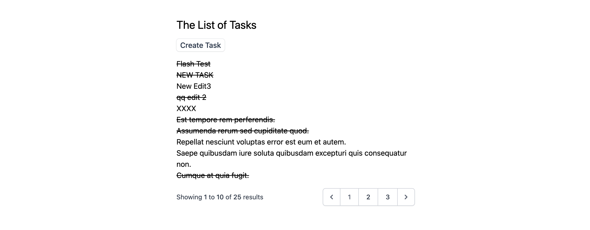
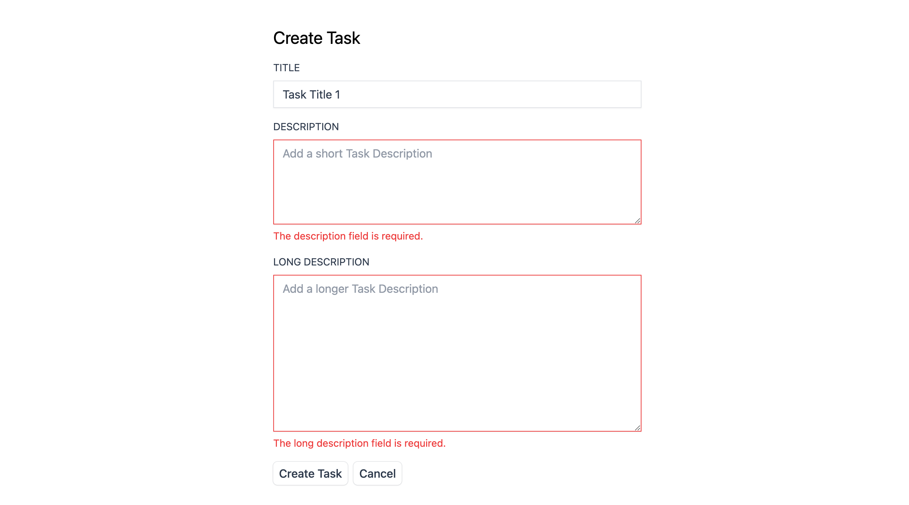
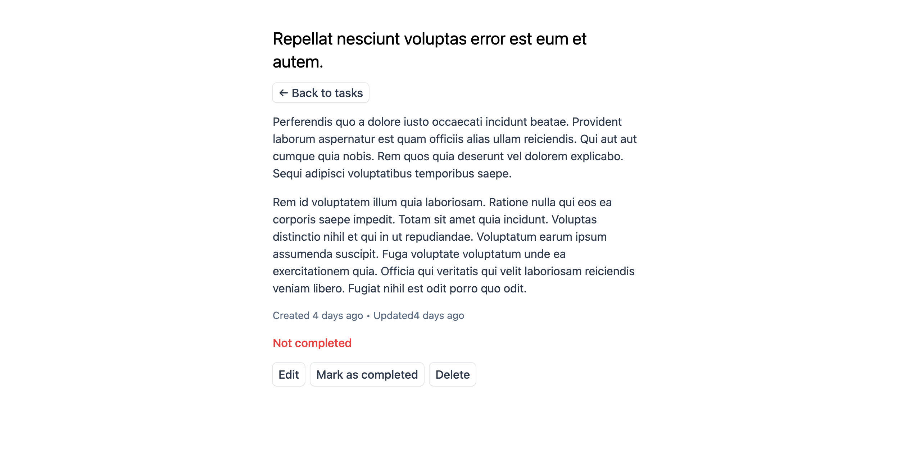
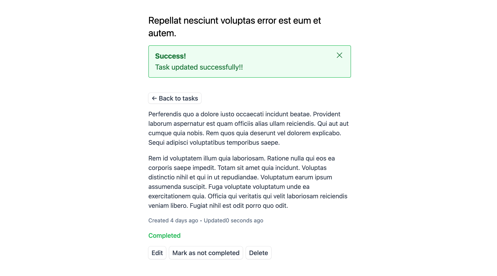

### Project Summary

This project is a task list application that allows users to create, edit, and delete tasks. The application is built using a Laravel 11 backend, Blade templating for the views, a docker-based MariaDB for data storage, TailwindCSS for styling and Alpine.js for Flash message interaction.

### Features

-   Task creation
-   Task editing
-   Task deletion
-   Task status tracking
-   User authentication
-   Task sorting and filtering

### Installation Instructions

1. Clone the repository
2. Install the required dependencies (e.g., PHP, MariaDB, Composer, Laravel 11). Note: CDN links are used to load TailwindCSS and Alpine.js.
3. Create a database and import the database file
4. Configure the application's .env configuration file. Note: for my .env, I need to `docker compose up` with Docker running in the background.
5. Start the application by accessing the index.php file. Note: for my set up, `php artisan serve` is used to start the application.
6. The application should run at `http://127.0.0.1:8000` in the browser.

### Usage Instructions

1. To create a new task, click the "Create Task" button and enter the task details.
2. To edit an existing task, click the "Edit" button next to the individual task.
3. To delete a task, click the "Delete" button next to the individual task.
4. To mark a task as completed, click the "Completed" button next to the individual task.
5. You can click the close button to close any Flash message but these will automatically disappear too on page refresh.

**Note**: The application is not optimized for production, and is intended for demonstration purposes only.

### Screenshots

#### Task List Screenshot of Home Page

#### Create Task Form with Error Validation

#### Single Task Page with Edit, Delete, and Completed Buttons

#### Task with Success Flash Message after marked as complete

